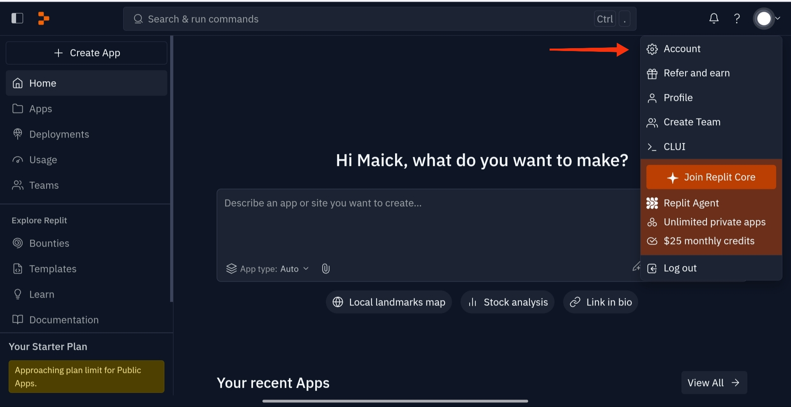

# This is a basic tutorial to you can do commits in your remote repositories, by you mobile devices using Replit dev tool.

### First step:
Connect to your acount (you can use google account).
After you connect, you will need to connect your github account.
click in gear icon to acces your account configuration.
### Main menu

### Configuration menu

