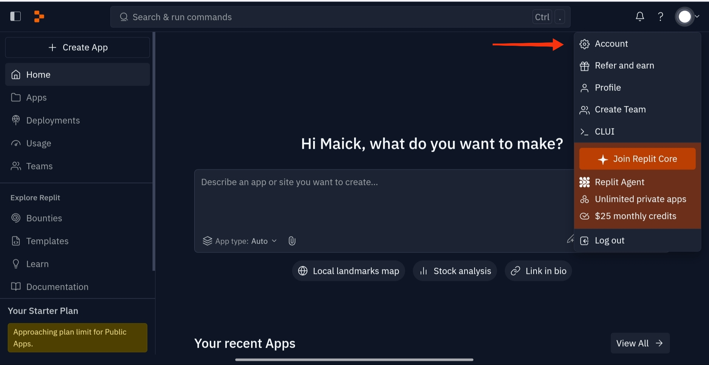
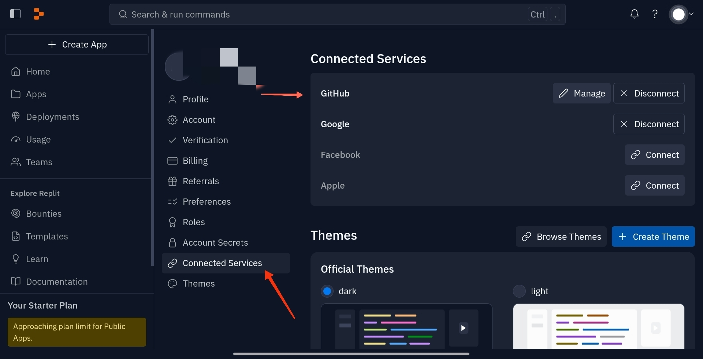
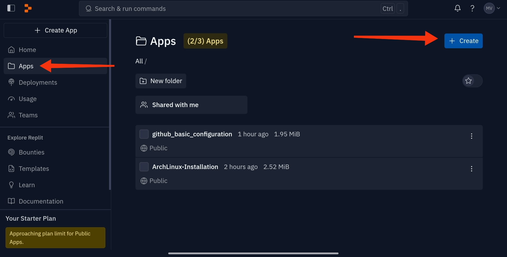
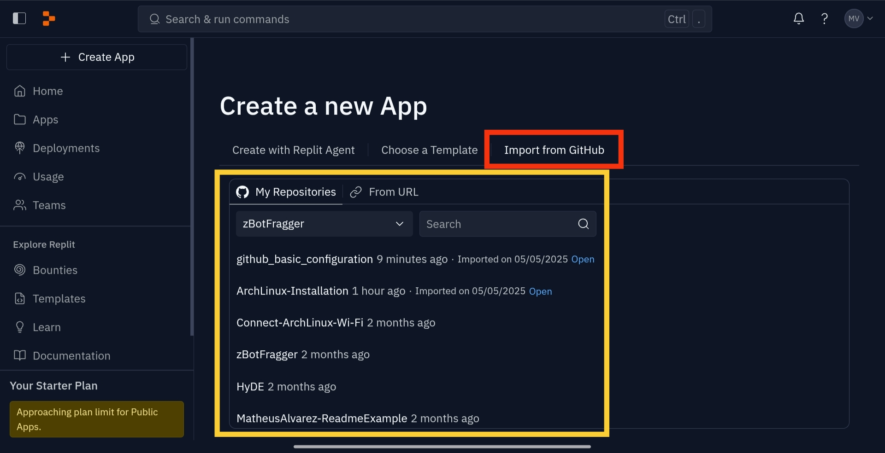
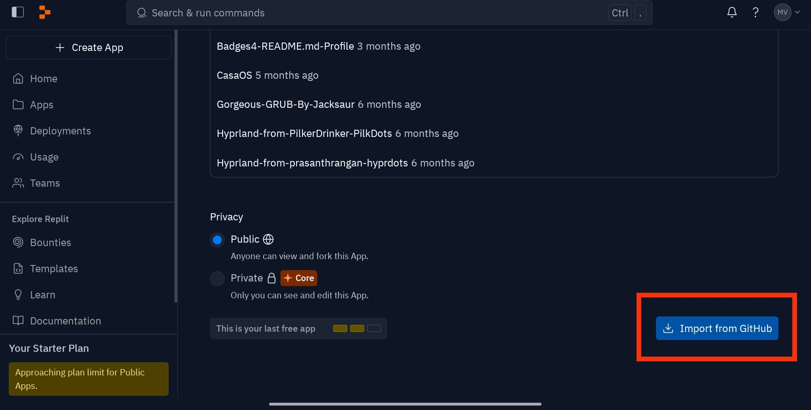

# This is a basic tutorial to you can do commits in your remote repositories, by you mobile devices using Replit dev tool.

## First step:
Connect to your acount (you can use google account).
### Main page


## Second step:
After you connect, you will need to connect your github account.
Click in gear icon to acces your account configuration.
### Configuration menu


## Third step:
Now, if you are correctly connected to your github account, you can configure your workspace.
To configure, you will need open a remote repository, with the configuration made before, you will can access it.
Click in "Create button" to begin a new project.




Obs: You can create a "New Repository" previously or can open an oldest, in github page.
After you select the mode, new or old repository, scroll down the page until the "Import From Github" button.






Now, we can configure our workspace.
We will need configure the credentials.
Digite the follow commands:

```
git config --global user.name "yourUser"
```
and
```
git config --global user.email "yourEmail@yourDomain.com"